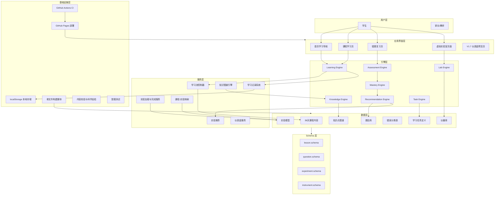
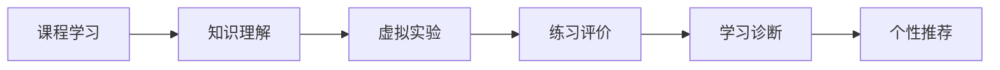
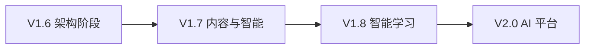

# ChemLab-G9-S2 模块与功能地图

本文档梳理 ChemLab-G9-S2 的完整模块架构、功能清单与开发计划，作为项目结构的第一事实源之一。基于代码结构（`content-s2/`、`engine/`、`core/`、`modules/`、`lab/`、`dashboard/`）与 `docs/` 下全部开发文档整理。

## 一、系统模块图

## 二、功能图（学习闭环）

核心学习闭环：课程学习 → 知识理解 → 虚拟实验 → 练习评价 → 学习诊断 → 个性推荐。

## 三、功能清单

| 功能域 | 子功能 | 状态 |
|--------|--------|------|
| 课程学习 | 36天内容导航、6大模块、每日45-60分钟课时 | 已完成 |
| 知识引擎 | 知识点图谱（V2-K1xx~K4xx）、前置/关联关系 | 已完成 |
| 练习系统 | 36天题库、基础/提升/挑战三档、答案解析 | 已完成 |
| 错题系统 | 错题复习队列、间隔复习、薄弱知识点聚合 | 已完成 |
| 虚拟实验 | 实验数据模型、安全监督标记 | 已完成 |
| LAB 引擎 | 实验播放器、渲染器、状态机、错误诊断 | 骨架完成 |
| 掌握度引擎 | 掌握度估算、证据加权更新 | 骨架完成 |
| 推荐引擎 | 基于掌握度的任务推荐 | 骨架完成 |
| 学习记录 | localStorage 进度/实验/答题记录（`chemlab-g9:v4:s2:*`） | 已完成 |
| 游戏化 | 连续天数、8枚徽章、连击、迷你折线图 | 已完成 |
| 仪表盘 | 学习进度、掌握度报告、实验历史 | 骨架完成 |
| 单文件离线 | 551KB 自包含、零外部依赖、iPad 可用 | 已完成 |
| 部署 | GitHub Pages 自动部署、CI 校验 | 已完成 |

## 四、开发计划

| 版本 | 目标 | 具体内容 |
|------|------|----------|
| V1.6（当前） | 架构升级 | 内容/UI 分离、实验 Schema、知识图谱 Schema、LAB 引擎骨架、仪表盘骨架 |
| V1.7（下一步） | 内容与智能 | 8章/40天/50+实验/500+题；补全 LAB UI；错题诊断系统；知识图谱数据落地 |
| V1.8 | 智能学习 | 学习分析、知识掌握模型、个性化推荐落地 |
| V2.0 | AI 平台 | AI 化学导师、学生档案、自适应学习路径、智能反馈 |

### V1.7 当前优先级

1. LAB Engine UI 实现（实验交互页面）
2. 仪器可视化资产库
3. 实验交互系统
4. 知识数据扩展
5. 题目与错题诊断系统
