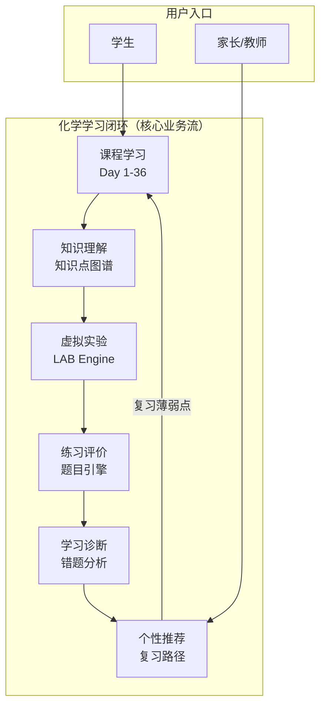
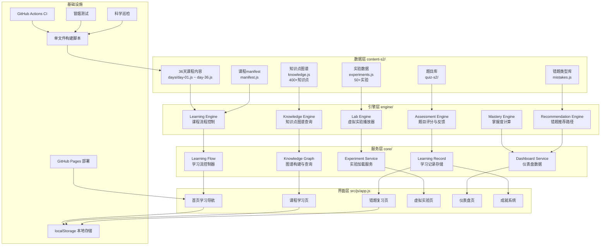
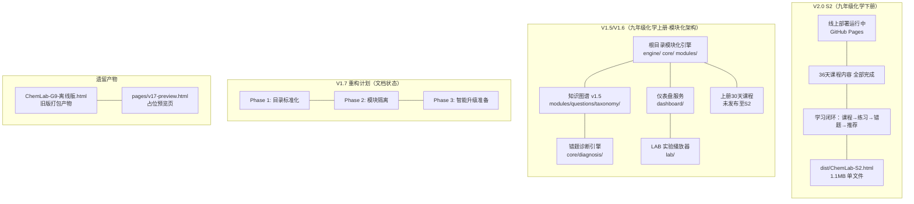

# ChemLab-G9 架构分析 & 版本建议

> 生成时间：2026-08-10  
> 基于：S2/docs/ARCHITECTURE.md, docs/V1.6-DEVELOPMENT-PLAN.md, docs/V1.7-REFACTOR-PLAN.md, 代码结构扫描

---

## 一、业务逻辑图



---

## 二、模块架构图（S2 线上版）



---

## 三、版本现状全景图



---

## 四、版本混乱分析

### 问题诊断

| 问题 | 表现 | 影响 |
|------|------|------|
| 双版本并行无整合 | S2（下册）与根目录 V1.5（上册）互不引用 | 知识图谱、实验数据无法跨册复用 |
| 版本号体系冲突 | S2 自报 v1.0.0，根目录文档写 V1.6/V1.7 | 外部无法判断哪个是"当前版本" |
| V1.7 计划未执行 | 文档中有 Phase 1/2/3，但代码无对应提交 | 重构计划悬空 |
| 遗留产物未清理 | 离线版 HTML、v17-preview.html 仍在仓库 | 混淆用户与部署路径 |
| 知识图谱数据重复 | 根目录 modules/questions/taxonomy/ 与 S2 content-s2/knowledge/ 内容重叠 | 维护两份数据 |
| 仪器库数据分散 | 根目录 modules/instruments/ 有6个JSON，S2 中无对应引用 | 实验可视化无法跨版本使用 |

### 核心矛盾

```
S2（单文件版）
├── 优点：部署简单，iPad 可直接打开
├── 缺点：内容耦合在 JS 内，扩展困难
└── 状态：已发布，功能完整

根目录（模块化版）
├── 优点：代码分层清晰，适合长期维护
├── 缺点：未整合进 S2，没有运行入口
└── 状态：开发中，代码可用但未部署
```

---

## 五、后续开发计划（V1.8 整合阶段）

### 阶段一：版本整合（预计 2 周）

```
目标：将根目录模块化引擎接入 S2，形成统一版本体系

Step 1: 确定版本号
  - S2 升级至 v2.0（明确为九年级化学下册）
  - 上册内容创建独立仓库或 subdirectory：ChemLab-G9-S1
  - 根目录 V1.5/V1.6 引擎代码迁移至 S2/core/ 目录

Step 2: 合并知识图谱数据
  - 将 modules/questions/taxonomy/knowledge-graph.json 的节点
    合并进 S2/content-s2/knowledge/knowledge.js
  - 建立统一的知识点 ID 规范（如 K317 已存在，继续 K318-K400）

Step 3: 实验数据整合
  - 将 lab/experiment-player.js 与 content-s2/experiments/experiments.js 对接
  - 将 modules/instruments/*.json 的图标引用接入 S2 assets/icons/

Step 4: 清理遗留产物
  - 删除 ChemLab-G9-离线版.html（已被 S2/dist/ 替代）
  - 删除 pages/v17-preview.html（功能已被 S2 替代）
  - 删除根目录 docs/ 下的 V1.5/V1.6/V1.7 文档（迁移至 S2/docs/）
```

### 阶段二：功能增强（预计 3 周）

```
目标：补齐用户指南中提到的四大功能

Feature 1: 错题本完善
  - 当前 mistakes.js 仅 69 行，数据稀疏
  - 需要：错误类型标签体系、错题聚合查询、按知识点分组复习
  - 参考：core/diagnosis/ 已有诊断引擎骨架

Feature 2: 学习档案
  - 当前 localStorage 存储较简单（chemlab-g9:v3:*）
  - 需要：增加学习时长、各知识点正确率趋势、实验完成记录
  - 参考：dashboard/learning-progress.js 已有基础

Feature 3: 实验专题
  - 当前 experiments.js 357 行，以数据为主
  - 需要：将 lab/experiment-player.js 渲染逻辑接入 S2 界面
  - 参考：V1.6-DEVELOPMENT-PLAN.md Phase 2 已有规划

Feature 4: AI 化学助手（V2.0）
  - 纯前端无法实现，需要接入 LLM API
  - 预留接口：core/diagnosis/diagnosis-engine.js 已定义输入输出格式
  - 待 V2.0 阶段实现，当前仅做接口定义
```

### 阶段三：体验优化（持续）

```
- iPad Safari 触控优化（已部分完成，需测试覆盖）
- 暗色模式完善
- 离线包体积优化（当前 1.1MB，目标 <800KB）
- 多册内容统一导航（上册/下册切换）
```

---

## 六、版本命名建议

```
ChemLab-G9 系列版本号规范：

V2.0.x  → 九年级化学下册（S2）线上版
           例：V2.0.1 = 基础功能完善
           例：V2.1.0 = 错题本升级
           例：V2.2.0 = 实验专题上线
           例：V3.0.0 = AI 化学助手（需要后端/LCM API）

V1.x.x  → 九年级化学上册（S1，待创建独立仓库）
           保持 V1.x.x 编号以示与下册区分
```

---

## 七、立即可执行的清理操作

```bash
# 1. 删除遗留产物
rm ChemLab-G9-离线版.html
rm pages/v17-preview.html
rmdir pages/  # 若为空

# 2. 归档根目录 V1.5/V1.6 文档（保留但不作为主文档）
mkdir -p docs/archive/v1-legacy
mv docs/V1.5-Architecture.md docs/V1.6-ARCHITECTURE.md \
   docs/V1.6-DEVELOPMENT-PLAN.md docs/V1.7-REFACTOR-PLAN.md \
   docs/archive/v1-legacy/

# 3. 在 S2/docs/ 中创建统一架构文档
# 4. 更新根目录 README.md 明确版本定位
# 5. 更新 S2/VERSION.md 版本号
```

---

## 八、总结

**当前状态：**
- S2（下册36天）已完整并发布，是线上唯一运行版本
- 根目录模块化引擎代码可用，但未整合进 S2
- 版本命名混乱，S2 自报 v1.0.0 与根目录 V1.6 文档冲突

**建议优先级：**
1. **立即清理**：删除遗留产物，归档旧文档（半天）
2. **统一版本**：S2 版本号改为 V2.0.0，README 明确定位（半天）
3. **知识图谱整合**：合并根目录 taxonomy 数据至 S2（1周）
4. **实验引擎接入**：将 lab/ 播放器接入 S2（1周）
5. **错题本完善**：基于 core/diagnosis/ 扩展数据（1周）
6. **AI 助手预留接口**：完成接口定义，V2.1 接入（长期）

**核心原则：**
- S2 是线上主体，所有新功能优先接入 S2
- 根目录模块化代码作为"引擎库"供 S2 引用，不再独立部署
- 上册（S1）创建独立仓库，保持版本清晰
